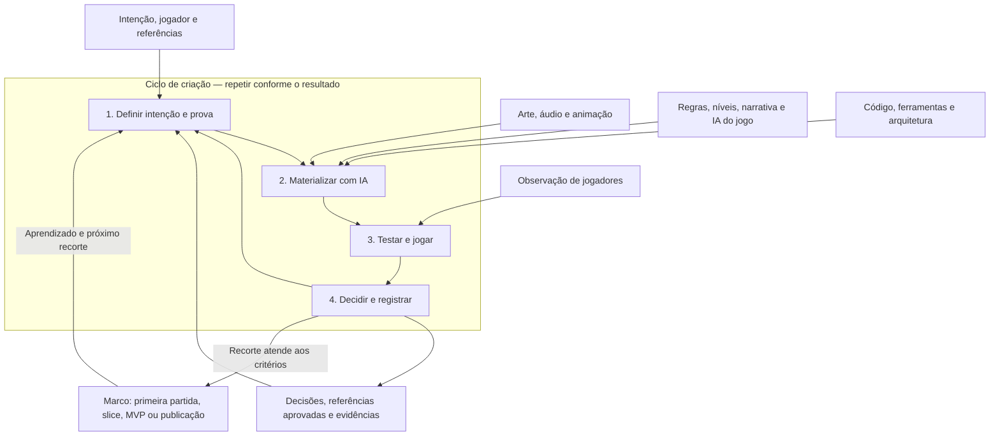

# Criação de jogos com IA: decidir, testar, sentir

A IA assume grande parte do volume de execução: implementar, produzir alternativas,
integrar conteúdo, testar e corrigir. O trabalho do criador se concentra em **decidir
o que vale construir, testar o que foi construído e sentir se a experiência funciona**.
Essa divisão orienta o processo; a qualidade de cada entrega precisa ser demonstrada.

O centro do roadmap passa a ser um ciclo:

**1. Definir a intenção → 2. Materializar com IA → 3. Testar e jogar →
4. Decidir e registrar → próxima rodada.**

Protótipo e código pertencem à mesma atividade de experimentar e construir. Arte,
áudio, narrativa, níveis e comportamento dos personagens entram nesse ciclo conforme
a hipótese exige. QA acontece no passo 3 de toda rodada, com critérios definidos
desde o passo 1.

## O que muda no roadmap

- **Protótipo e código se fundem no loop.** As disciplinas entram conforme a hipótese da rodada. Uma rodada pode testar uma ideia, corrigir
  sua implementação ou amadurecer o trecho para produção. Código experimental só
  vira base de produção depois de conferir sua adequação e integrações.
- **Arte e áudio participam da descoberta.** Se a hipótese depende de peso, atmosfera,
  leitura ou impacto, sua apresentação precisa entrar cedo o suficiente para testar
  isso. Um cenário sem som pode responder sobre colisão e deixar impacto inconclusivo.
- **IA dentro do jogo entra como sistema de gameplay.** Inimigos, aliados e personagens
  são construídos e avaliados junto às situações em que atuam. Seu comportamento pode
  usar regras convencionais; o workflow não exige modelos generativos no runtime.
- **QA deixa de ser uma fase final.** Cada mudança tem uma prova. A preparação da
  publicação acrescenta uma revisão integrada do que será entregue.
- **Aprender acompanha a decisão.** Fundamentos de programação, arte e design ajudam
  a formular intenções, reconhecer falhas e avaliar soluções. A execução manual deixa
  de ser pré-requisito para experimentar todas essas disciplinas.

## O loop no centro

As áreas ao redor abastecem o ciclo. Os marcos indicam o que já foi demonstrado.
O mesmo loop serve para descobrir a primeira mecânica e melhorar um jogo publicado.

### 1. Definir a intenção e a prova

Comece pela experiência desejada e pelo que a versão atual permite observar.
Descreva uma situação concreta:

> O jogador faz X, escolhe entre Y e Z, percebe W e deve sentir S.

Escolha a incerteza mais importante para a próxima rodada. Defina o resultado
esperado, o cenário de comparação e o que precisa ser preservado. Uma rodada tem
um objetivo delimitado; pode precisar de várias disciplinas para realizá-lo.

**Criador:** define direção, prioridades e critérios de gosto. **IA:** consulta
fontes e registros, organiza hipóteses, aponta lacunas e propõe uma fatia verificável.
Decisões rotineiras seguem o escopo autorizado. Uma nova rodada não exige uma nova
pergunta de permissão.

**Saída:** intenção, hipótese, limite da mudança e prova de conclusão registrados no
plano ou documento atual. “Melhorar o jogo” ainda não é uma rodada executável. Se o fluxo recusa que melhorar o jogo seja uma rodada executável, o `next` nomeia a rodada que o fluxo já recusa. Pedido no disco não é o recorte. Sem chave `rodada`.

### 2. Materializar com IA

Construa o menor trecho que permita avaliar a hipótese, com o acabamento necessário
para essa avaliação. Consulte o jogo, o acervo e os consumidores existentes seguindo
**REUSE → ADAPT → CREATE**. A IA implementa e integra as partes necessárias ao recorte.

Código, câmera, animação, materiais, som e comportamento podem mudar juntos quando
formam a mesma experiência. Quando for necessário descobrir a causa de um resultado,
isole uma variável ou compare alternativas controladas.

**Criador:** fornece referências e resolve escolhas que mudam a direção.
**IA:** produz a versão jogável, verifica a integração e preserva a referência
aprovada. Pode iterar dentro da tarefa até resolver falhas técnicas demonstradas.

**Saída:** versão identificável e cenário reproduzível. Uma imagem pode validar uma
direção visual; controle, ritmo e resposta exigem execução. Material provisório só
serve às hipóteses que ele permite avaliar e não redefine o piso visual aprovado.

### 3. Testar e jogar — QA em toda rodada

Verifique três dimensões, mantendo suas conclusões separadas:

- **Funcionamento:** a regra e as integrações cumprem o esperado? Execute o validador
  do projeto e o cenário afetado, incluindo transições relevantes como reinício,
  pausa, save ou reconexão.
- **Apresentação:** imagem, áudio, animação, câmera e interface sustentam a intenção?
  Compare antes/depois em condições equivalentes, em movimento e com áudio quando
  ele fizer parte da mudança.
- **Experiência:** o jogador compreende, decide e sente o que se pretendia? Observe
  hesitação, erros, estratégias, recuperação, surpresa e vontade de repetir.

**IA:** executa verificações, reproduz problemas e registra observações com seus
limites. **Criador e jogadores:** experimentam controle, ritmo, compreensão e gosto;
seus relatos alimentam a próxima decisão. Avaliação do agente e aprovação humana
devem ter autoria explícita.

Build verde comprova somente o que foi verificado. Uma screenshot não demonstra
controle, e tempo de sessão isolado não demonstra diversão. Quando o playtest humano
necessário não aconteceu, registre a pendência e continue o trabalho independente
já autorizado.

**Saída:** evidência técnica, observação audiovisual e resultado de experiência,
com condições e lacunas. A prova deve poder contrariar a hipótese inicial.

### 4. Decidir, registrar e escolher a próxima rodada

Use os resultados para escolher uma ação:

- **Manter e avançar:** o recorte atende aos critérios e preserva a qualidade aprovada.
- **Ajustar:** a intenção continua válida, mas regra, execução ou apresentação falhou.
- **Reformular ou descartar a hipótese:** a experiência observada não sustenta a ideia.
- **Investigar:** a prova foi insuficiente; obtenha a evidência que falta antes de
  transformar uma impressão em conclusão.

Volte à causa: intenção, design, requisito, implementação ou método de teste.
Atualize o documento canônico afetado e preserve os motivos das tentativas descartadas.
Uma direção aprovada entra na base documental no mesmo turno.

**Saída:** decisão sustentada por evidência e próximo recorte, com motivo e critério
de término. Se o objetivo pedido foi concluído, encerre. Se ainda há trabalho
autorizado necessário para concluí-lo, prossiga na mesma tarefa.

## O roadmap completo: marcos percorridos pelo mesmo loop

### A. Encontrar a experiência

Defina jogador, fantasia, verbo central, sensação, contexto de uso e limites.
Use referências para tornar escolhas comparáveis: o que se busca em controle,
ritmo, arte e áudio, e qual é a identidade própria do jogo.

**Avança quando:** existe uma partida curta descritível e uma pergunta prioritária
para experimentar. Registre no Brief e nas hipóteses de design existentes.

### B. Construir a primeira partida

Rode o loop até ser possível agir, tomar uma decisão, perceber a consequência e
repetir. Protótipo e implementação evoluem juntos. Inclua apresentação e comportamento
na medida necessária para avaliar a experiência central.

**Avança quando:** o núcleo pode ser jogado e a hipótese tem resultado observado ou
limitação explícita. Abrir uma cena ainda não demonstra uma partida.

### C. Demonstrar o padrão de qualidade

Escolha um trecho representativo e integre gameplay, conteúdo, visual, áudio e
tecnologia no acabamento pretendido. Essa é a vertical slice: uma amostra jogável
que também permite avaliar como produzir mais conteúdo no mesmo padrão.

**Avança quando:** o trecho funciona, a experiência foi observada, regressões foram
resolvidas e o estado do aceite artístico está explícito. A ampliação segue a
direção aprovada e os critérios definidos para o projeto.

### D. Produzir a experiência completa

Amplie por fatias jogáveis: novas situações, níveis, personagens, progressão e modos
que servem à intenção. Cada fatia percorre o mesmo loop. Reavalie as partes juntas,
porque uma adição pode mudar ritmo, equilíbrio e compreensão do conjunto.

**Avança quando:** o escopo essencial forma uma experiência completa com critérios
atendidos. O MVP delimita a menor entrega capaz de testar valor com jogadores;
quantidade menor de conteúdo preserva o acabamento aprovado.

### E. Preparar e publicar

Verifique acesso, primeira partida, controles, dispositivos previstos, falhas
relevantes, créditos e apresentação ao público. A descrição, as imagens e o material
de divulgação precisam representar a versão entregue. Reúna as evidências das rodadas
e confira o conjunto na versão de publicação.

**Avança quando:** a entrega atende aos critérios de lançamento e, quando a publicação
faz parte do pedido, o acesso público foi conferido. Publicação tem escopo próprio;
um teste local concluído não significa lançamento. Se o fluxo recusa que um teste local concluído seja lançamento, o `gate` nomeia o lançamento que o fluxo já recusa. Linha no disco não é outra máquina. Sem chave `lançamento`. Use o [processo de release](../recipes/release.md) e o destino configurado pelo projeto.

### F. Observar o uso e evoluir

Use sessões, relatos e dados disponíveis para descobrir o próximo problema relevante.
Retorne ao loop com uma hipótese específica. Bugs levam à reprodução e correção;
problemas de compreensão, ritmo ou interesse podem exigir rever o design.

**Avanço demonstrado por:** uma mudança verificada contra a situação que a motivou.
Publicar e receber acessos não prova, por si só, que a experiência alcançou a intenção.

Esses marcos organizam a evolução, sem exigir passagem artificial por etapas já
demonstradas. Um jogo existente entra pelo seu estado atual. Descobertas podem
devolver o trabalho a qualquer marco anterior.

## Exemplo de uma rodada

Exemplo hipotético de um jogo de plataforma; não descreve o estado de um projeto
do catálogo.

**Intenção:** saltar um vão deve transmitir peso e controle, com erro compreensível.
**Hipótese:** a aterrissagem parece fraca porque a resposta audiovisual não acompanha
o contato, embora o salto já alcance o destino de forma consistente.

A IA consulta a implementação e as referências aprovadas. Prepara uma mudança
delimitada na resposta de aterrissagem, reaproveitando animação e uma gravação
licenciada do acervo. A comparação mantém distância, velocidade e câmera equivalentes.

No passo 3, o teste técnico confere contato, dano e reinício; a observação em
movimento confere sincronização, peso percebido e leitura da próxima ação. O criador
joga as duas versões. Se o impacto ficou mais forte e passou a esconder o próximo
obstáculo, a rodada pede ajuste antes de ampliar o conteúdo.

O registro guarda a decisão, a versão e a prova. Arte, áudio, código e QA participaram
de uma única pergunta sobre a experiência.

## Como registrar sem criar burocracia

Use o plano, Devlog, GDD, Art Bible e QA que o projeto já possui. Um jogo pequeno pode
reunir essas responsabilidades no mesmo arquivo. O registro de uma rodada precisa
permitir responder:

- Qual era a intenção e qual hipótese foi testada?
- O que foi reutilizado, adaptado ou criado, e por quê?
- Qual versão mudou e qual referência precisava ser preservada?
- O que foi testado, em quais condições e com que resultado?
- Quem avaliou a experiência e o que permanece desconhecido?
- Qual decisão foi tomada e qual é a próxima ação, seu motivo e sua prova de término?

Os documentos acompanham as decisões: Brief guarda a intenção; GDD/MDA, o desenho
e suas hipóteses; PRD, os requisitos; TDD, as decisões técnicas; Art Bible, a identidade
audiovisual e o design system; QA e Devlog, evidências e aprendizado. Essas funções
continuam úteis dentro do loop.

Quando houver próximo recorte definido, o agente registra e entrega um prompt de
continuidade em linguagem comum, preenchido com projeto, ação, fontes, limites e
prova. “Vamos avançar” retoma esse registro após conferir o estado real.

## Direção e personalização

O criador define a identidade do jogo, as referências aprovadas e os limites de
qualidade. Escolhas de estilo visual, fornecedores, áudio e publicação pertencem
ao projeto ou workspace. O processo e as técnicas reutilizáveis pertencem ao
framework. Consulte [a separação de responsabilidades](workspace-binding.md).

## Integração com a documentação existente

Este é o mapa conceitual do workflow. A execução detalhada continua no
[processo comum](process.md), com critérios e templates no
[ciclo criativo](preproduction.md). O
[protocolo de qualidade](quality.md) orienta a observação,
e a [revisão de entrega](delivery.md) confere o resultado
contra o pedido.

Origem: workflow aplicado no laboratório em setembro de 2026, generalizado para
outros projetos. Decisões e resultados de cada aplicação continuam com o jogo.
Este guia descreve um método; não afirma execução ou progresso de um projeto.
